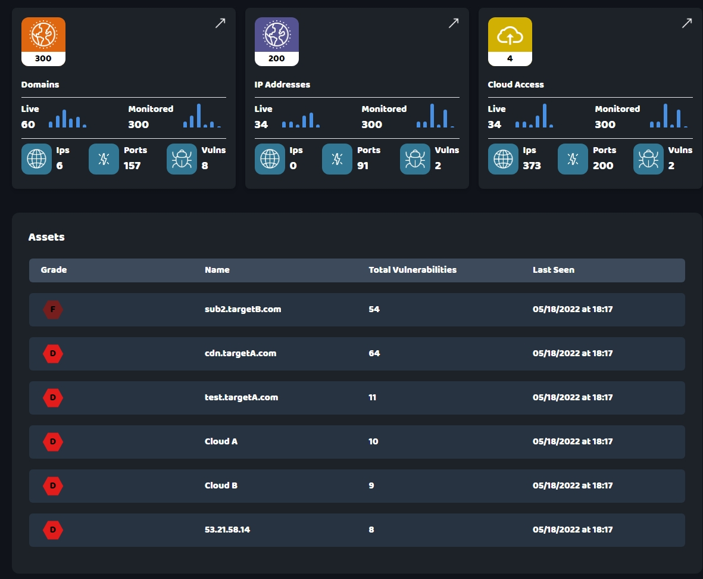

# NetbanSharif Test Project by Tahereh Sharifian

A dedicated dashboard developed by NetbanSharif, utilizing React and Tailwind CSS, without the incorporation of additional libraries.

This project demonstrates:

- **State Management:** Implementation using React's state management techniques.
- **External API Integration:** Effective interaction with external APIs.
- **Data Handling:** Efficient management of data flow between components, including dynamic filtering on click.
- **Component Connectivity:** Seamless interaction among React components.
- **Code Quality:** Adherence to clean coding practices.
- **File Organization:** Structured and maintainable file architecture.

## Project showcase

The following screenshot and video illustrate the final output of the code within this repository.
[download the video](http://localhost:3000/final_result.mp4)

